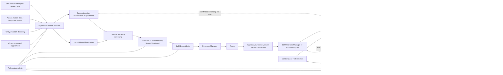

# 系統架構規格

## 1. 架構風格

第一版採 **Python modular monolith + PostgreSQL authoritative ledger + background workers**。模組可獨立測試、具有明確 Port/Adapter，但交易一致性先留在單一部署單元；只有在實際觀測到容量或隔離需求後才拆服務。



## 2. 信任邊界

| 區域 | 可讀 | 可寫 | 明確禁止 |
|---|---|---|---|
| Source ingestion | exact-host GET-only公開網頁／API、cache、per-source scoped secret | raw store、source metadata、security-master candidates | broker credentials、orders、source-role自動升權 |
| LLM analysis workers | sanitized `AnalysisInput`／EvidencePacket、固定 graph/prompt/model versions、去識別化完整 portfolio snapshot | analyst reports、兩種 debate state、Trader plan、`PortfolioProposal` | shell、任意網路、portfolio/order/ledger DB write、broker calls／credentials |
| Risk engine | proposal、權威 ledger/account/market state、immutable P4 policy | RiskDecision、一次 rejection feedback、核准long-only TargetPortfolio／zero-submit intent plan | 讓 LLM 放寬runtime limits、short authority、接受自由文字action |
| Execution worker | approved OrderIntent、Paper credential | outbox/broker order mapping | 研究內容、live endpoint |
| Reconciler | broker account/orders/positions/fills | authoritative broker mirror | 新增策略委託 |
| Control plane | system state | pause/cancel/paper-flatten commands | live account operations |

所有公開網頁都視為不可信輸入。網頁中的「忽略系統指令」「下單」「洩露金鑰」只是內容，不可成為 agent instruction。

## 3. 模組邊界

建議 package layout：

```text
src/seven_lens/
  config/          typed settings, endpoint allowlist, feature flags
  clock/           NYSE calendar, deadlines, job instances, leases
  sources/         Tavily/GDELT discovery, SEC/IR/government/exchange adapters, manifests
  market_data/     Alpaca bars/quotes/corporate actions, yfinance supplement, quality checks
  securities/      point-in-time identity/symbol lineage and corporate-action quarantine
  universe/        point-in-time universe and filters
  screening/       quant factors and evidence prioritization
  analysis/        TradingAgents analysts, two debates, managers, trader, reflection
  analysis/providers/ capability-aware Chat/Responses provider adapters
  analysis/schemas/ reports, debate states, snapshots and PortfolioProposal
  memory/          immutable reflections + weekly bounded LLM-visible memory
  portfolio/       proposal normalization and approved target portfolio
  risk/            pre/post-trade constraints and kill switches
  execution/       intents, outbox, Alpaca Paper adapter, price collars
  reconciliation/ broker mirror and ledger repair workflow
  ledger/          positions, lots, cash, NAV, events
  observability/   logs, metrics, traces, alerts, reports
  control/         CLI/API for pause, cancel, status, paper flatten
  backtest/        as-of simulation and economic fill model
  evals/           analysis parity, evidence, portfolio, safety and model evals
  plugins/         future analyst plugins; disabled by default
```

依賴方向只能由外向內透過 interface：domain 不 import Alpaca/Tavily/OpenAI SDK；adapter 實作 domain ports。

## 4. 核心資料契約

所有契約使用 versioned JSON Schema/Pydantic，欄位含 `schema_version`、`run_id`、`created_at`、`as_of`、`producer_version`。

### 4.1 SourceFragment

```text
source_id, canonical_url, author, publisher, source_role
provider_record_id, security_identity_refs
observation_period, published_at, discovered_at, retrieved_at, available_at
effective_at?, vintage_date?
content_hash, excerpt, content_type, language
license_status, access_method, primary_source, robots_status
claim_tags, ticker_tags, supersedes, tombstone
```

`available_at` 是歷史模擬可讀取的最早時間；不能只用文章自稱的 `published_at`。
`source_role` 僅允許 `AUTHORITY|CONFIRMATION|DISCOVERY|RESEARCH_SUPPLEMENT`；adapter 或 fallback 不得在
runtime 自動改變角色。FRED/ALFRED observation period、vintage 與 retrieval time 必須分開。

### 4.2 EvidencePacket

```text
symbol, as_of, universe_snapshot_id
market_snapshot_id, source_fragment_ids
facts[], claims[], contradictions[], missing_evidence[]
freshness_status, coverage_score, prompt_injection_flags
packet_hash
```

### 4.3 AnalystReport

```text
role: TECHNICAL | FUNDAMENTALS | NEWS | SENTIMENT
symbol, as_of, horizon, input_snapshot_ids[]
summary, observations[], material_claims[]
citation_ids[], counterevidence_ids[], missing_evidence[]
risks[], catalysts[], invalidators[], confidence
prompt_version, model_version, provider_version
status: VALID | INVALID | ABSTAIN
```

禁止直接輸出 `BUY 100 shares`、券商 order type 或 unrestricted target price。

### 4.4 Research/Risk debate → PortfolioProposal

```text
InvestmentDebateState: symbol, bull_arguments[], bear_arguments[], round_count=2,
                       verified_claims[], disputed_claims[], unresolved_conflicts[]
RiskDebateState: aggressive_arguments[], conservative_arguments[],
                 neutral_arguments[], round_count=2, unresolved_conflicts[]
PortfolioSnapshot: nav, cash, buying_power, positions[], open_orders[],
                   same_day_fills[], borrow_status[], remaining_limits,
                   snapshot_hash, as_of
PortfolioProposal: proposal_id, portfolio_snapshot_hash, window,
                   requests[{symbol, action: OPEN|INCREASE|REDUCE|CLOSE|HOLD,
                             side: LONG|SHORT|FLAT, target_weight,
                             confidence, evidence_ids[], reason_codes[],
                             same_day_exit_reason_code?, invalidators[]}],
                   graph/prompt/model/provider/data/memory versions,
                   expiration_at, status: VALID|INVALID|ABSTAIN
```

`PortfolioProposal` 是要求，不是已核准委託。它不含 share quantity、order type、broker endpoint、credential 或長篇建議文字；只有 `VALID` 可交給 deterministic Risk Engine。每個 target weight 的絕對值上限 15%，但 schema 通過不代表風控通過。

P3 schema維持可表達±15%以保留既有immutable contract；P4第一版policy另行收緊為long-only、單股5%、
long/total gross 90%、現金至少10%、15檔、SEC SIC Division sector 25%、126-session correlation cluster 30%、
gross normal turnover 20%。short request會以
`SHORT_DISABLED`拒絕，不能形成target或intent。

上述分類與計算固定由ADR-039四個immutable manifests執行：`p4-factor-v1`、
`sec-sic-division-v1`、`p4-correlation-cluster-v1`、`p4-gross-turnover-v1`。runtime/env/model不得
override；manifest hash不符即fail closed。Sector只從point-in-time SEC SIC映射，不使用GICS名稱或推測分類。

### 4.5 TargetPortfolio → OrderIntent

```text
RiskDecision: review_round: 1|2, status: APPROVED|REJECTED|NO_TRADE,
              accepted_targets, rejected_targets, reason_codes,
              remaining_limits, constraints_snapshot
TargetPortfolio: nav_ref, long_target_weights, constraints_snapshot,
                 approved_risk_decision_id
IntentPlan: symbol, side, whole_share_quantity, intent_type, price_collar,
            earliest_submit_at, cancel_at, target_version, idempotency_key,
            status: APPROVED_NO_SUBMIT
```

P4只產生zero-submit `IntentPlan`；轉為可進P2 outbox的`OrderIntent`屬後續Gate。Quantity使用FULL+CLEAN
reconciliation後的NAV／projected positions，向零取整，並套用minimum adjustment、rebalance band、quote age、
spread與collar。P4 composition不得持有broker submit port。

### 4.6 Broker objects

```text
BrokerOrder: broker_order_id, client_order_id, submitted_at, status
Fill: execution_id, broker_order_id, qty, price, occurred_at
ReconciliationResult: broker_snapshot_hash, ledger_snapshot_hash,
                      mismatches, repair_actions, status
```

### 4.7 CorporateActionRecord／ExitOutcome（P4-B record/quarantine已驗收Closed；exit仍為P4-E～P7 planned）

```text
CorporateActionRecord:
  event_id, security_id, symbol_lineage, event_type: FORWARD_SPLIT|REVERSE_SPLIT
  ratio, declaration_at, effective_at, ex_date
  source_record_ids[], confirmation_status, confirmed_at
  state: DETECTED|ENTRY_BLOCKED|CONFIRMED|EXIT_PENDING|EXITED|POST_EVENT_RECONCILED|REVIEW_REQUIRED

CorporateActionExitOutcome:
  event_id, intent_id, order_ids[], fill_ids[], reconciliation_id
  quantity, cost_basis, average_exit_price
  realized_gross_pnl, fees, realized_net_pnl, return_rate, holding_period
  reason_code: CONFIRMED_FORWARD_SPLIT|CONFIRMED_REVERSE_SPLIT
```

只有 SEC／issuer／listing exchange 正式公告閉合 identity、ratio、日期與 point-in-time visibility 後才是
`CONFIRMED`。只有 Alpaca 或 discovery/supplement 記錄時可 `ENTRY_BLOCKED`，不可自動退出。最終 P&L 只從
權威 fills＋FULL reconciliation 計算，不相信 intent 或 broker UI 預估。

## 5. 狀態機

### 5.1 Research run

```text
PLANNED -> INGESTING -> SCREENING -> ANALYZING -> DEBATING
        -> MANAGING_RESEARCH -> TRADER_DECIDING -> RISK_DEBATING
        -> PORTFOLIO_PROPOSING -> VERIFYING -> RISK_REVIEW
        -> RESUBMISSION_OR_TARGET_FROZEN -> RISK_APPROVED -> EXECUTION_WINDOW
        -> RECONCILING -> COMPLETE
```

Risk 第一次拒絕後只能以同一已驗證研究、刷新後的完整 portfolio snapshot 與 rejection feedback 回到 `PORTFOLIO_PROPOSING` 一次；不重跑 Analysts／debates，也不能加入本 run 候選集合外的標的。第二次拒絕進 `NO_TRADE`。任何前置狀態可到 `INVALID`；deadline 到達且尚未 `RISK_APPROVED` 則 `EXPIRED`。`INVALID/EXPIRED/NO_TRADE` 不得復活成同一窗口的可交易 run。

### 5.2 Order intent

```text
CREATED -> RISK_APPROVED -> OUTBOX_PENDING -> SUBMITTING
        -> ACKNOWLEDGED -> PARTIALLY_FILLED -> FILLED
        -> CANCEL_PENDING -> CANCELED
```

另有 `REJECTED`、`EXPIRED`、`UNKNOWN`。timeout 後先進 `UNKNOWN` 並用 `client_order_id` 查詢；禁止直接重送。

### 5.3 拆股／合股保護

```text
DETECTED -> ENTRY_BLOCKED -> CONFIRMED -> EXIT_PENDING -> EXITED
                                        -> REVIEW_REQUIRED
EXITED -> POST_EVENT_RECONCILED -> ENTRY_ELIGIBLE
```

- 候選建立、P4核准與broker submit前三次重驗；`ENTRY_BLOCKED` 不能建立新的 analysis authority或新增曝險。
- 已持有 long 且事件 `CONFIRMED` 時跳過LLM，但不跳過 symbol orders解析／取消、FULL+CLEAN reconciliation、
  tradability、regular-hours window、price collar、idempotent outbox與submit-time recheck。
- 新 authority 使用 `CORPORATE_ACTION_EXIT`，不能冒充一般 Risk approval或人工全帳戶 `flatten_paper`。
- effective date 已過、停牌、identity／quantity失真、來源撤回／衝突或未能安全平倉時進
  `REVIEW_REQUIRED`，pause entries並告警；不得用舊quantity盲目下單。
- 第一版不自動 BUY-to-cover short；任何 short corporate-action exit 需新的authority與驗收。

## 6. 排程與併發

- 本機 `launchd` 保持一個 supervisor 常駐，程式自行根據 Alpaca calendar 建立當日 job instances。
- PostgreSQL job table 以 unique key `(trading_date, job_type, window)` 和 lease 防止雙啟動。
- 每個 target freeze 產生 immutable version；execution 只讀指定 version。
- 同一帳戶同一時間只有一個 execution lease。
- 系統重啟先 reconciliation，完成前不執行 pending outbox。
- clock skew 超過門檻或 timezone 不一致時 fail closed。

## 7. 儲存

### PostgreSQL（權威）

- run/job 狀態、設定 snapshot、point-in-time security master／universe metadata；
- analyst reports/debate states/investment decisions/target/risk decisions；
- immutable daily reflection、open-position observations、Risk rejection、corporate-action confirmation／exit
  outcome／P&L lineage 與 memory-curation versions；
- intents/outbox/orders/fills；
- broker account/position mirrors、lots、NAV；
- audit events、control commands、alerts、model calls。

Migration/schema owner與application runtime是不同capabilities。owner只執行migration、disposable
restore drill與runtime-role provisioning；runtime必須是外部建立、通過catalog proof的non-owner login，
不得擁有schema CREATE、database TEMP、authoritative object ownership、direct lease/job mutation或
function/trigger replacement權限。privileged functions使用`pg_catalog, public, pg_temp`固定search path並
完整schema-qualify authoritative objects；細節見`SECURITY.md`與ADR-016。

權威domain/audit ledger只接受registered typed payload，不保存raw LLM/web/evidence JSON；PostgreSQL
constraint獨立執行同一registry。所有persisted `JsonObject`套用depth、node、width、key/string與final
serialized byte budgets。大型raw evidence只能進未來另行驗收的content-addressed boundary。

### Parquet + DuckDB（研究）

- point-in-time bars/factors；
- immutable evidence metadata 和 derived datasets；
- backtest features/results。

### Content-addressed object store（本機）

- 以 SHA-256 保存必要的 raw capture、normalized text、SEC filing；
- repository 只提交 manifests/fixtures，不提交大批受著作權保護內容。

### LLM-visible memory

- 每日即使部位未平倉也寫入 bounded reflection；權威原始 decisions/outcomes/rejections 只追加，不刪除。
- 每週六以獨立 memory-curation skill 產生濃縮版本，最多 4,000 行；只保留反覆錯誤、Risk rejection、有效／失敗模式、forecast calibration、position lesson 與 regime。
- 濃縮 memory 是衍生資料，可重建且有 source record ids；不得回寫或取代 immutable audit，也不得讓未來 outcome 進入歷史 `as_of` run。
- Corporate-action記憶必須標成Paper operational-risk exit，不得被整理器改寫為thesis failure；只有成交且
  FULL reconciliation後的收益可進realized outcome。

### LLM provider adapters

- P3-E目前所有Analyst、Research、Trader、Risk Debate與Portfolio Manager角色固定
  `agnes-2.5-flash`／Chat Completions exact endpoint，無fallback、無automatic retry；其他provider/model皆disabled。
- 上述production transport邊界不變。P3-F synthetic eval由較高層、exact authorization-bound orchestrator處理
  transient transport：同一hash-closed logical case只對`TIMEOUT`／`TRANSIENT`／`RATE_LIMIT`最多retry兩次，
  2s／4s exponential backoff加bounded deterministic jitter，三個連續cases耗盡retry即開circuit，260 logical
  requests最多780 attempts；沒有model fallback。每次attempt以當下wall clock產生新的180秒deadline。
- P3-F Offline Correctness與Live Model Quality是功能Gate；Provider Transport另為rolling營運Gate。單次batch成功
  不能宣稱未來availability，transport未達first-attempt 95%／eventual 99%時不得開始P6 Shadow。
- runtime不能覆寫host/path/model，不能用`/models`或環境proxy自動改route。
- 內部設定一律`reasoning_requested=MAX`；目前沒有官方＋authorized live證據支持Agnes的MAX參數，
  因此不傳未知參數並記`reasoning_effective=UNKNOWN`。
- `gpt-5.6` 只在未來通過同一 held-out/safety/latency/schema gate 後加入。任何模型切換都不得改變內部 schema 或 deterministic risk semantics。

### Secrets

- `SecretProvider` application port 只接受 typed、exact `SecretRef`，不提供 list/search/write/update/delete/export；domain/application 不依賴 PyObjC、Keychain、環境變數或資料庫。
- macOS production adapter 只以 Security.framework `SecItemCopyMatching` 查 generic password，固定 service/account mapping、`match all` 與禁止 authentication UI；零筆、多筆、拒絕、locked、timeout、malformed 或 backend failure 全部 fail closed，沒有 env／argv／DB／第二 provider fallback。
- `ScopedSecretProvider` 在 backend call 前強制 exact-reference allowlist。execution scope 才可取得 Alpaca Paper refs；research/LLM scope 只可取得 Agnes／OpenCode／未來經核准的 OpenAI／Tavily refs。未來 FRED／BLS／BEA／EIA 等 key 必須各有新的 typed `SecretRef` 與 exact-host GET-only adapter；公開 SEC／IR／exchange／GDELT 也不能因此取得任意網路能力。這是 application capability boundary，不是 OS sandbox。
- P3-E只啟用exact ref `seven-lens.paper-trading.agnes.api-key/primary`；OpenCode與其他provider refs不在
  research composition scope，未來需新決策及gate才能新增。
- Alpaca/OpenAI account 固定為 `primary`；Tavily account 使用既有規則驗證的非秘密 `account_id`。Tavily 每個 key 只有 account metadata、compliance、quota、usage、reset/cooldown 狀態可進 DB，只有 `AUTHORIZED_ACCOUNT_POOL` 才能啟用多 key router。
- `SecretValue` 只降低 `str/repr/log/serialization` 意外洩漏，不是程序記憶體加密或 OS isolation；plaintext 只能在未來 client composition boundary 透過明確 reveal 方法取得。
- `.env.example` 只列非秘密設定；測試與未來 CI 只使用明顯 fake secret，絕不查詢使用者 Keychain。

## 8. Broker 執行設計

1. Risk engine 在同一 DB transaction 寫 `OrderIntent` 與 outbox event。
2. Worker 取得 lease，建立 deterministic `client_order_id`：策略／交易日／窗口／target version／symbol／side。
3. 提交前再次讀 broker orders/positions、quote、clock 和 control flags。
4. 只用 limit order + price collar；第一版不使用無保護 market order。
5. API timeout：以 `client_order_id` 查 REST，存在則綁定，不存在且仍在窗口才重試同 id。
6. WebSocket `trade_updates` 低延遲更新；REST 是最終 reconciliation 依據。
7. 到 `cancel_at` 取消未成交；partial fill 更新實際部位，不為達 target 盲目追價。
8. 每次 window 後比較 broker cash/orders/positions/fills 與本地 ledger。
9. `CORPORATE_ACTION_EXIT` submit 前重做事件 authority、identity、effective date與position quantity closure；
   成交後以FULL reconciliation封閉結果並計算已實現收益。

## 9. 正常窗口、同日交易與緊急分析

- 第一窗口在開盤後 60 分鐘開始，處理全部持倉與最多 12 個候選；第二窗口在收盤前 90 分鐘開始，處理全部持倉與最多 5 個候選。
- 完整 graph deadline 15 分鐘；時間不足、provider failover 仍失敗或 Risk 第二次拒絕都 `NO_TRADE`。
- P4 long-only profile的normal daily gross turnover上限NAV 20%；以前一regular-session close的FULL+CLEAN
  reconciled NAV為分母，normal fills、working remainder與proposal使用absolute notional相加，不除以2且不得net。
  同日獲利退出可用；同日虧損退出需結構化
  reason code與evidence，不能只因為虧損。
- 同日退出後可在正常窗口重新進場；不得藉此繞過 turnover、gross/net/name 或 borrow limits。
- event monitor 只把經二次確認的事件送入緊急 graph：價格需雙來源且連續三個 fresh samples；官方 primary announcement 可單源確認新聞。衝突或延遲為 `DATA_CONFLICT`。
- 緊急 graph 只分析受影響與高度相關持倉，只允許 `HOLD/REDUCE/CLOSE`，deadline 3 分鐘。未驗證事件不交給 LLM；deterministic hard-risk 仍可獨立產生 `RISK_EXIT`。
- 確認的 forward/reverse split 不進緊急 graph：候選直接 quarantine；已持有 long 走 deterministic
  `CORPORATE_ACTION_EXIT`。通知與日報必須明示事件類型、標的、來源、ratio、日期、成交與收益。
- 半日市的各 cutoff 由 close time 相對計算。

## 10. Control plane

所有控制命令具 id、actor、reason、requested_at、applied_at 和 audit event：

- `status`：顯示 clock、run、broker mirror、limits、alerts。
- `pause_entries`：停止新增／加碼，允許取消或降風險。
- `resume_entries`：必須先通過 health + reconciliation；不能由 timeout 自動恢復。
- `cancel_open_orders`：取消 Paper 未成交委託。
- `flatten_paper`：只對 Paper 帳戶產生受控平倉 intent；要求明確二次確認。
- runtime lifecycle 尚無安全停止 consumer，因此 control API 不宣告
  `shutdown_after_reconcile`；若未來需要，必須先在 P6/P7 實作可驗證的 lifecycle consumer。

無人值守不代表沒有人工緊急控制；它代表正常日不需人工批准每一筆交易。

## 11. Observability

- PostgreSQL audit 是權威稽核紀錄；metrics、traces 與 diagnostic 不能取代 audit，也不能參與或改變 business transaction。
- processing path 顯式傳遞 immutable `TelemetryContext`（`run_id/correlation_id/trace_id/span_id/parent_span_id`），不使用 ambient context；沒有 processing context 的 startup/config log 不偽造 ID。
- JSON structured logs 可安全注入已驗證 context，仍先經 bounded redaction 與 fixed fallback；invalid context 直接拒絕。
- P1-C2 application ports只接受 typed metric/span records；registry 封閉 names、attribute keys、enum values、長度與每 instrument 64 active series。metric attributes 禁止 run/trace IDs、account/job/symbol、URL/DSN/Authorization、payload 與 exception material。
- P1-C2 只有 secret lookup 與 fenced `transition_job_with_audit` instrumentation；secret bridge 不含 telemetry，job 成功 metrics 只在 DB commit 與 UoW 正常退出後記錄。
- recorder `Exception` 轉為 process-local drop count與固定、無 exception detail diagnostic；不觸發 transaction commit/rollback/retry。`BaseException` 不被吞掉。
- P1-C2 不引入 OpenTelemetry、Prometheus、Sentry、exporter/backend SDK 或 network client；未來 adapter 必須在 infrastructure/composition boundary 實作現有 ports。
- metrics：job latency、source freshness、Tavily global/per-account credits、account-pool compliance mode、各 analyst/debate/manager/trader/portfolio latency、provider failover、requested/effective reasoning、schema failures、abstention、Risk rejection/resubmission、data conflicts、orders、fills、slippage、reconciliation mismatches、limit usage。
- 每次 LLM call 保存 model、prompt template version、input packet hash、output hash、tokens、latency、status、requested/effective reasoning；不記 secret或帳戶識別資訊。
- 告警分 `INFO/WARN/HIGH/CRITICAL`；CRITICAL 觸發 `pause_entries`，告警傳送失敗不取消 fail-closed 行為。
- 日報必須同時顯示「策略想做什麼」「風控拒絕什麼」「券商實際發生什麼」。

## 12. 非功能需求

- 關鍵交易路徑不依賴任何付費資料或 GUI automation。
- 所有 timestamp 以 UTC 儲存、顯示時轉 NY/Taipei。
- 交易與 reconciliation domain 達高覆蓋單元、integration、property、fault-injection tests。
- 任何 migration 可向前套用；破壞性 migration 需備份與 rollback rehearsal。
- dependency lock、SBOM、secret scan、第三方 license manifest。
- recovery point：交易帳本零可接受遺失；研究 cache 可重建。
