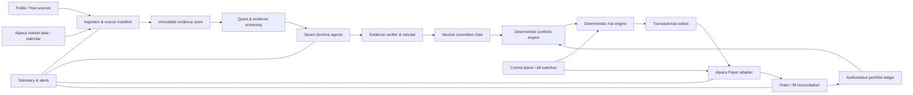

# 系統架構規格

## 1. 架構風格

第一版採 **Python modular monolith + PostgreSQL authoritative ledger + background workers**。模組可獨立測試、具有明確 Port/Adapter，但交易一致性先留在單一部署單元；只有在實際觀測到容量或隔離需求後才拆服務。



## 2. 信任邊界

| 區域 | 可讀 | 可寫 | 明確禁止 |
|---|---|---|---|
| Source ingestion | 公開網頁、API、cache | raw store、source metadata | broker credentials、orders |
| LLM research workers | sanitized EvidencePacket、doctrine version | assessment table | shell、網路任意存取、portfolio ledger、broker |
| Portfolio engine | verified verdicts、positions、constraints | TargetPortfolio | broker calls、修改 evidence |
| Risk engine | targets、ledger、market state | RiskDecision、OrderIntent | 放寬 runtime limits |
| Execution worker | approved OrderIntent、Paper credential | outbox/broker order mapping | 研究內容、live endpoint |
| Reconciler | broker account/orders/positions/fills | authoritative broker mirror | 新增策略委託 |
| Control plane | system state | pause/cancel/paper-flatten commands | live account operations |

所有公開網頁都視為不可信輸入。網頁中的「忽略系統指令」「下單」「洩露金鑰」只是內容，不可成為 agent instruction。

## 3. 模組邊界

建議 package layout：

```text
src/seven_lens/
  config/          typed settings, endpoint allowlist, feature flags
  clock/           NYSE calendar, deadlines, job instances, leases
  sources/         Tavily, SEC, IR, web capture, manifests
  market_data/     bars, quotes, corporate actions, quality checks
  universe/        point-in-time universe and filters
  screening/       quant factors and evidence prioritization
  doctrines/       seven versioned doctrine packages
  committee/       blinded passes, verifier, rebuttal, chair
  portfolio/       forecasts, optimizer, target portfolio
  risk/            pre/post-trade constraints and kill switches
  execution/       intents, outbox, Alpaca Paper adapter, price collars
  reconciliation/ broker mirror and ledger repair workflow
  ledger/          positions, lots, cash, NAV, events
  observability/   logs, metrics, traces, alerts, reports
  control/         CLI/API for pause, cancel, status, paper flatten
  backtest/        as-of simulation and economic fill model
  evals/           doctrine, committee, safety and model evals
```

依賴方向只能由外向內透過 interface：domain 不 import Alpaca/Tavily/OpenAI SDK；adapter 實作 domain ports。

## 4. 核心資料契約

所有契約使用 versioned JSON Schema/Pydantic，欄位含 `schema_version`、`run_id`、`created_at`、`as_of`、`producer_version`。

### 4.1 SourceFragment

```text
source_id, canonical_url, author, publisher
published_at, discovered_at, retrieved_at, available_at
content_hash, excerpt, content_type, language
license_status, access_method, primary_source, robots_status
claim_tags, ticker_tags, supersedes, tombstone
```

`available_at` 是歷史模擬可讀取的最早時間；不能只用文章自稱的 `published_at`。

### 4.2 EvidencePacket

```text
symbol, as_of, universe_snapshot_id
market_snapshot_id, source_fragment_ids
facts[], claims[], contradictions[], missing_evidence[]
freshness_status, coverage_score, prompt_injection_flags
packet_hash
```

### 4.3 DoctrineAssessment

```text
doctrine_id, doctrine_version, symbol, horizon
stance: SUPPORT | OPPOSE | ABSTAIN
thesis, causal_chain[], material_claims[]
citation_ids[], counterevidence_ids[]
catalysts[], invalidators[], uncertainty_sources[]
expected_return_band, downside_band, confidence
domain_relevance, freshness, assessment_status
```

禁止直接輸出 `BUY 100 shares`、券商 order type 或 unrestricted target price。

### 4.4 CommitteeVerdict

```text
symbol, assessments[], verified_claims[]
consensus_points[], dissent_points[], unresolved_conflicts[]
alpha_band, downside_band, confidence
correlation_haircut, evidence_quality, expiration_at
status: VALID | INVALID | ABSTAIN
```

### 4.5 TargetPortfolio → OrderIntent

```text
TargetPortfolio: nav_ref, target_weights, cash_target, constraints_snapshot
RiskDecision: accepted_targets, rejected_targets, reason_codes, limit_usage
OrderIntent: symbol, side, quantity, intent_type, price_collar,
             earliest_submit_at, cancel_at, target_version, idempotency_key
```

### 4.6 Broker objects

```text
BrokerOrder: broker_order_id, client_order_id, submitted_at, status
Fill: execution_id, broker_order_id, qty, price, occurred_at
ReconciliationResult: broker_snapshot_hash, ledger_snapshot_hash,
                      mismatches, repair_actions, status
```

## 5. 狀態機

### 5.1 Research run

```text
PLANNED -> INGESTING -> SCREENING -> DEBATING -> VERIFYING
        -> TARGET_FROZEN -> RISK_APPROVED -> EXECUTION_WINDOW
        -> RECONCILING -> COMPLETE
```

任何前置狀態可到 `INVALID`；deadline 到達且尚未 `RISK_APPROVED` 則 `EXPIRED`。`INVALID/EXPIRED` 不得復活成同一窗口的可交易 run。

### 5.2 Order intent

```text
CREATED -> RISK_APPROVED -> OUTBOX_PENDING -> SUBMITTING
        -> ACKNOWLEDGED -> PARTIALLY_FILLED -> FILLED
        -> CANCEL_PENDING -> CANCELED
```

另有 `REJECTED`、`EXPIRED`、`UNKNOWN`。timeout 後先進 `UNKNOWN` 並用 `client_order_id` 查詢；禁止直接重送。

## 6. 排程與併發

- 本機 `launchd` 保持一個 supervisor 常駐，程式自行根據 Alpaca calendar 建立當日 job instances。
- PostgreSQL job table 以 unique key `(trading_date, job_type, window)` 和 lease 防止雙啟動。
- 每個 target freeze 產生 immutable version；execution 只讀指定 version。
- 同一帳戶同一時間只有一個 execution lease。
- 系統重啟先 reconciliation，完成前不執行 pending outbox。
- clock skew 超過門檻或 timezone 不一致時 fail closed。

## 7. 儲存

### PostgreSQL（權威）

- run/job 狀態、設定 snapshot、universe metadata；
- assessment/verdict/target/risk decisions；
- intents/outbox/orders/fills；
- broker account/position mirrors、lots、NAV；
- audit events、control commands、alerts、model calls。

### Parquet + DuckDB（研究）

- point-in-time bars/factors；
- immutable evidence metadata 和 derived datasets；
- backtest features/results。

### Content-addressed object store（本機）

- 以 SHA-256 保存必要的 raw capture、normalized text、SEC filing；
- repository 只提交 manifests/fixtures，不提交大批受著作權保護內容。

### Secrets

- `SecretProvider` application port 只接受 typed、exact `SecretRef`，不提供 list/search/write/update/delete/export；domain/application 不依賴 PyObjC、Keychain、環境變數或資料庫。
- macOS production adapter 只以 Security.framework `SecItemCopyMatching` 查 generic password，固定 service/account mapping、`match all` 與禁止 authentication UI；零筆、多筆、拒絕、locked、timeout、malformed 或 backend failure 全部 fail closed，沒有 env／argv／DB／第二 provider fallback。
- `ScopedSecretProvider` 在 backend call 前強制 exact-reference allowlist。execution scope 才可取得 Alpaca Paper refs；research/LLM scope 只可取得 OpenAI／Tavily refs。這是 application capability boundary，不是 OS sandbox。
- Alpaca/OpenAI account 固定為 `primary`；Tavily account 使用既有規則驗證的非秘密 `account_id`。Tavily 每個 key 只有 account metadata、compliance、quota、usage、reset/cooldown 狀態可進 DB，只有 `AUTHORIZED_ACCOUNT_POOL` 才能啟用多 key router。
- `SecretValue` 只降低 `str/repr/log/serialization` 意外洩漏，不是程序記憶體加密或 OS isolation；plaintext 只能在未來 client composition boundary 透過明確 reveal 方法取得。
- `.env.example` 只列非秘密設定；測試與未來 CI 只使用明顯 fake secret，絕不查詢使用者 Keychain。

## 8. Broker 執行設計

1. Risk engine 在同一 DB transaction 寫 `OrderIntent` 與 outbox event。
2. Worker 取得 lease，建立 deterministic `client_order_id`：策略／交易日／窗口／target version／symbol／side。
3. 提交前再次讀 broker orders/positions、quote、clock 和 control flags。
4. 只用 limit order + price collar；第一版不使用無保護 market order。
5. API timeout：以 `client_order_id` 查 REST，存在則綁定，不存在且仍在窗口才重試同 id。
6. WebSocket `trade_updates` 低延遲更新；REST 是最終 reconciliation 依據。
7. 到 `cancel_at` 取消未成交；partial fill 更新實際部位，不為達 target 盲目追價。
8. 每次 window 後比較 broker cash/orders/positions/fills 與本地 ledger。

## 9. 收盤前再交易的限制

- 只處理既有持倉、上午未達 target、以及預先排入 top list 的少數候選。
- 新增 gross exposure 不得超過 NAV 5%；日換手上限仍適用。
- 15:15 後沒有新的完整 evidence packet，不因一則新聞即興建立部位。
- 同日買入的部位不可賣出，除明確 `RISK_EXIT`。
- 半日市的各 cutoff 由 close time 相對計算。

## 10. Control plane

所有控制命令具 id、actor、reason、requested_at、applied_at 和 audit event：

- `status`：顯示 clock、run、broker mirror、limits、alerts。
- `pause_entries`：停止新增／加碼，允許取消或降風險。
- `resume_entries`：必須先通過 health + reconciliation；不能由 timeout 自動恢復。
- `cancel_open_orders`：取消 Paper 未成交委託。
- `flatten_paper`：只對 Paper 帳戶產生受控平倉 intent；要求明確二次確認。
- `shutdown_after_reconcile`：完成 reconciliation 後安全停止。

無人值守不代表沒有人工緊急控制；它代表正常日不需人工批准每一筆交易。

## 11. Observability

- PostgreSQL audit 是權威稽核紀錄；metrics、traces 與 diagnostic 不能取代 audit，也不能參與或改變 business transaction。
- processing path 顯式傳遞 immutable `TelemetryContext`（`run_id/correlation_id/trace_id/span_id/parent_span_id`），不使用 ambient context；沒有 processing context 的 startup/config log 不偽造 ID。
- JSON structured logs 可安全注入已驗證 context，仍先經 bounded redaction 與 fixed fallback；invalid context 直接拒絕。
- P1-C2 application ports只接受 typed metric/span records；registry 封閉 names、attribute keys、enum values、長度與每 instrument 64 active series。metric attributes 禁止 run/trace IDs、account/job/symbol、URL/DSN/Authorization、payload 與 exception material。
- P1-C2 只有 secret lookup 與 fenced `transition_job_with_audit` instrumentation；secret bridge 不含 telemetry，job 成功 metrics 只在 DB commit 與 UoW 正常退出後記錄。
- recorder `Exception` 轉為 process-local drop count與固定、無 exception detail diagnostic；不觸發 transaction commit/rollback/retry。`BaseException` 不被吞掉。
- P1-C2 不引入 OpenTelemetry、Prometheus、Sentry、exporter/backend SDK 或 network client；未來 adapter 必須在 infrastructure/composition boundary 實作現有 ports。
- metrics：job latency、source freshness、Tavily global/per-account credits、account-pool compliance mode、LLM calls、schema failures、abstention、orders、fills、slippage、reconciliation mismatches、limit usage。
- 每次 LLM call 保存 model、prompt template version、input packet hash、output hash、tokens、latency、status；不記 secret。
- 告警分 `INFO/WARN/HIGH/CRITICAL`；CRITICAL 觸發 `pause_entries`，告警傳送失敗不取消 fail-closed 行為。
- 日報必須同時顯示「策略想做什麼」「風控拒絕什麼」「券商實際發生什麼」。

## 12. 非功能需求

- 關鍵交易路徑不依賴任何付費資料或 GUI automation。
- 所有 timestamp 以 UTC 儲存、顯示時轉 NY/Taipei。
- 交易與 reconciliation domain 達高覆蓋單元、integration、property、fault-injection tests。
- 任何 migration 可向前套用；破壞性 migration 需備份與 rollback rehearsal。
- dependency lock、SBOM、secret scan、第三方 license manifest。
- recovery point：交易帳本零可接受遺失；研究 cache 可重建。
