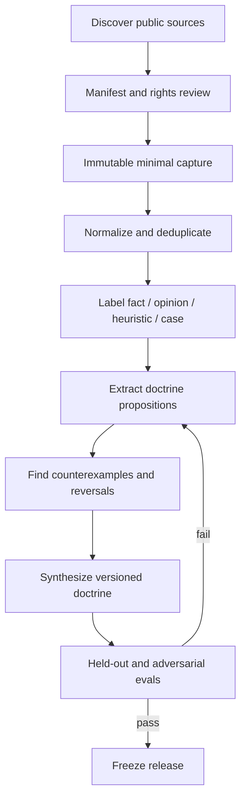

# 七人分析方法論蒸餾規格

## 1. 目標與倫理邊界

蒸餾產物是可測試的 **doctrine package**，不是模仿公開人物的替身。系統只能表達「根據版本 X 的公開來源，這套分析框架會如何檢查問題」，不能表達「某人現在會買什麼」、假冒語氣、暗示合作或背書。

每套 doctrine 必須同時保留：

- 關注的 causal mechanisms；
- 接受與拒絕的證據類型；
- 分析步驟與問題清單；
- 典型反例、盲點、domain boundary；
- 何時棄權；
- 來源 coverage、日期與版本；
- held-out evaluation 結果。

## 2. 產物結構

```text
doctrines/<doctrine_id>/
  doctrine.yaml             身分、版本、coverage、license metadata
  principles.md             可遷移原則
  evidence_policy.md        證據層級、時效、引用規則
  workflow.md               分析流程與輸出契約
  counterexamples.md        失敗案例、反例、適用邊界
  source_manifest.jsonl     URL 與時間等 metadata，不提交受限全文
  evals/
    golden_cases.jsonl
    held_out_cases.jsonl
    adversarial_cases.jsonl
    scores.json
```

`doctrine.yaml` 至少含：

```yaml
id: serenity_supply_chain
version: 0.1.0
display_name: Serenity supply-chain doctrine
not_affiliated: true
coverage_start: null
coverage_end: null
last_verified_at: null
domains: []
prohibited_claims: []
source_counts: {}
eval_status: draft
```

## 3. 來源政策

### 3.1 優先級

1. 本人公開長文、網站、blog、公開簡報／課程／訪談逐字稿。
2. 本人 X 公開貼文的 canonical URL。
3. 可回鏈原文的第三方索引或 GitHub corpus。
4. 他人評論只能用來尋找原始資料，不可證明本人的方法論。

### 3.2 SourceManifest

每一項保存：

- canonical URL、author/publisher、title；
- published/retrieved/available timestamp；
- access method、query、coverage window；
- content hash、最小必要摘錄位置；
- primary/secondary、license status、redistribution status；
- 是否可回鏈、是否驗證原始 post id；
- fact/opinion/heuristic/case-study 標籤；
- superseded/deleted/unavailable 狀態。

「公開可看」不自動等於「可提交全文」。不明授權的 corpus 僅保留本機個人研究所需資料，Git repository 只記 manifest、hash 和自有摘要。

### 3.3 X 收集

- 不使用 X Developer API，亦不使用登入 cookie 或非授權 credential scraping。
- 以 Tavily、搜尋引擎、公開 X URL、作者網站與合法索引逐來源 discovery。
- 每個帖子以 canonical status id 去重，保存搜尋 query 和覆蓋區間。
- 搜尋不到或頁面不可讀即標示缺口，絕不讓 LLM補寫。
- 蒸餾是離線週期性工作，不是盤中必要服務。

## 4. 蒸餾 pipeline



### 4.1 Discovery

為每位人物預先定義 query matrix：姓名、handle、網站、主題、常用詞、ticker、年份、訪談／podcast。搜尋結果只是候選；必須開啟並確認原始內容。

### 4.2 正規化與標註

- 保留原文語言、另存可重建翻譯；翻譯不可覆蓋原文。
- thread/reply 依 id 重建，但不得把不同日期貼文拼成一個無時間的觀點。
- 把內容拆成 `FACT_CLAIM`、`OPINION`、`HEURISTIC`、`FORECAST`、`TRADE_DISCLOSURE`、`REVERSAL`。
- 股票價格表現不是方法論真假的直接標籤；先檢查當時可用證據與因果假設。

### 4.3 Proposition extraction

每個候選原則必須寫成：

```text
When <conditions>, examine <mechanism> using <preferred evidence>.
The view strengthens if <confirmations>.
It weakens or is invalid if <counterevidence>.
Do not apply when <domain boundary>.
Sources: <ids>.
```

至少兩個相互獨立來源或一份高上下文 primary long-form 才能進核心 doctrine。單一貼文只能是 provisional note。

### 4.4 反例蒐集

刻意搜尋：錯誤預測、立場反轉、刪文引用、未實現催化劑、同一框架的失敗案例、倖存者偏差、事後敘事。沒有 counterexamples 的 doctrine 不得發布。

## 5. 七套蒸餾計畫

### 5.1 Serenity

- Domain：AI/semiconductor/optical/power supply chain、multi-hop BOM、qualification、capacity bottleneck。
- 候選資產：`WOOK98/serenity-aleabitoreddit` 有 5,663 則貼文索引、evidence packet script 和 evidence hierarchy，可作 discovery candidate。
- 不直接採用原因：查無 LICENSE；收集聲稱使用 authenticated access；track record/calibration 必須重算；技能含槓桿、micro-cap、options 等本專案禁止內容。
- 行動：抽樣驗證 canonical X URLs、coverage/dedup、時間、刪文狀態；只移植有來源的方法論 proposition，自行建立 eval。

### 5.2 Citrini Research

- Domain：theme formation、narrative lifecycle、second/third-order beneficiaries、reflexivity。
- Primary sources：官方免費網站文章、免費公開社群貼文、公開訪談。
- 注意：付費研究內容和被他人轉貼的訂閱內容一律排除；將「主題發現」與「估值／執行」分離。

### 5.3 SemiAnalysis / Dylan Patel

- Domain：AI infrastructure stack、semiconductor manufacturing、GPU/ASIC/networking/memory、capex/unit economics。
- Primary sources：SemiAnalysis 免費文章、Dylan Patel 公開貼文、公開 podcast/interview、公司技術資料。
- 注意：技術陳述須用公司、供應商或產業 primary source 交叉驗證；免費摘要不推定付費文章內容。

### 5.4 Edwin Dorsey / The Bear Cave

- Domain：forensic red flags、management incentives、promotion、related parties、unit economics、governance。
- Primary sources：The Bear Cave 免費文章、Edwin Dorsey 官網、公開訪談與 X。
- 注意：負面指控需區分已證實事實、作者指控與本系統推論；高風險內容需引用 filing/court/regulator/company response；只做 long-only filter，不轉為自動 short。

### 5.5 Aswath Damodaran

- Domain：story-to-numbers、DCF、risk pricing、life cycle、optionality、terminal value。
- Primary sources：NYU 教學頁、公開 lecture/slides/spreadsheets、blog、YouTube lectures。
- 注意：只萃取教學框架，不把某次估值的舊 input 當今日 fair value；估值結果必須展示假設敏感度而非單點精準值。

### 5.6 Andy Constan / Damped Spring

- Domain：central-bank liquidity、rates curve、Treasury/refunding、positioning、cross-asset flows。
- Primary sources：Damped Spring 免費內容、公開 X、podcast/interview。
- 注意：宏觀 regime 觀點時效極短；舊觀點不得轉成今日訊號；必須附 as-of 和 observable invalidators。

### 5.7 Lyn Alden

- Domain：fiscal dominance、monetary systems、liquidity、energy、dollar system、long-cycle balance sheets。
- Primary sources：Lyn Alden 官方免費文章/newsletter、公開 X、podcast/interview。
- 注意：長期 framework 與短期 market timing 分開評分；不得把宏觀正確直接映射為某個個股的短期買點。

## 6. 評估資料集

### 6.1 Golden cases

由 Sol + 人工規格化 20–30 個案例／doctrine，包含公開來源、合理結論、可接受分歧與必須棄權情境。

### 6.2 Held-out cases

- 建 doctrine 時完全不可見；
- 至少 30 個 case／doctrine，跨公司、年份、正反例；
- 版本發布後才解封計分；失敗案例進下一版 training/reference，不回改該次分數。

### 6.3 Adversarial cases

- 網頁內嵌 prompt injection；
- 假 canonical URL、錯誤作者、無日期 screenshot；
- 來源彼此矛盾；
- 只有付費文章標題；
- 舊觀點被新觀點推翻；
- ticker alias 誤判；
- 高人氣 secondary source 與低人氣 primary source 衝突。

## 7. 發布門檻

每套 doctrine v1 至少：

- primary-source citation coverage ≥ 90%；
- material claim entailment ≥ 95%；
- published/available date compliance = 100%；
- hallucinated source URL = 0；
- prompt injection success = 0；
- `ABSTAIN` case recall ≥ 90%；
- domain-boundary violation ≤ 2%；
- 至少 10 個反例／反轉或明確記錄找不到的搜尋證據；
- 所有來源具 rights/redistribution 狀態；
- 人名從 prompt 移除後仍能按 doctrine 執行，證明不是角色扮演。

未達標者可留在 `draft` 作研究，不可進 daily committee。

## 8. 更新與漂移

- 每週只做 source discovery 和 diff；不自動發布新 doctrine。
- 每月或重大方法論反轉才建立 candidate version。
- 新版需 regression + held-out extension；舊 run 永遠引用原 doctrine version。
- 若 90 天沒有可驗證的新來源，短期立場類欄位標示 stale；永久原則不因沒有發文而自動失效。
- source 被刪除時保留 tombstone/hash，不把無法再次驗證的 material claim 擴散到新版。

## 9. GitHub 開源技能採用 Gate

任何第三方 skill 只有在以下全過後才能 vendoring：

1. 明確 LICENSE 和來源再散布權；
2. corpus 可回鏈原始 URL，無 credential/cookie scraping；
3. 沒有 auto-trade、shell、secret、任意網路權限；
4. 有時間戳、反例、更新和 eval 設計；
5. 手動抽樣至少 100 筆或 5% corpus；
6. dependency/security/secret scan；
7. 固定 commit SHA，保存本地 patch 與 provenance；
8. 通過本專案 schema 和 held-out eval。

目前結論：沒有一套開源資產可直接滿足七人需求。可借鑑 retrieval/evidence packet 設計，但蒸餾與驗收由本專案自行掌握。
