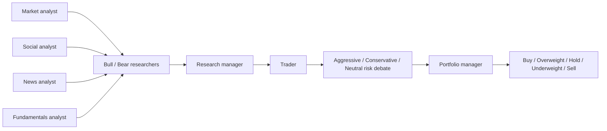

# TradingAgents 邏輯與程式架構評估

評估基準：`TauricResearch/TradingAgents` main commit `a33fd4c0f134485a43553a2c23a63cb14adbd88f`（本企劃研究時固定版本）。

## 1. 它實際怎麼運作

TradingAgents 以 LangGraph 建立單一股票的多角色研究流程：

主要 state 包含各 analyst report、investment debate state、trader investment plan、risk debate state 和 final trade decision。Portfolio Manager 綜合 trader plan 與三種風險觀點，輸出五級動作；signal processor 再抽取結論。

## 2. 值得採用的概念

- **角色分工**：市場、新聞、社群、基本面不是一個 prompt 全包。
- **先獨立研究後辯論**：能顯式保存 bull/bear 和 risk dissent。
- **有限輪次**：避免無限 agent 對談。
- **共享 state graph**：每一步輸出可成為 audit trail。
- **模型分層**：quick/deep 模型概念適合控制大量分析成本。
- **memory/evaluation idea**：可將過去決策結果回饋研究，但必須重新實作以避免資料洩漏。

## 3. 不適合直接用於自動交易的地方

### 3.1 問題定義是單一 ticker，不是跨股票組合

它回答「這一檔如何」，沒有建立 point-in-time universe、候選排名、資金競爭、相關性、sector exposure 或 portfolio optimization。本專案需先做 universe/quant/evidence funnel，再對少量候選執行辯論。

### 3.2 Portfolio Manager 是語言模型，不是硬約束引擎

Portfolio Manager 看的是文字 plan 和風險辯論，不掌握權威 broker cash、lots、open orders、ADV、當日 turnover、sector exposure、持有期限制。它產生的 Buy/Hold 等級不是可安全執行的 target portfolio。

### 3.3 沒有券商級狀態機

上游沒有：

- transactional outbox；
- deterministic `client_order_id`；
- timeout 後查單再重試；
- partial fill / cancel / reject / out-of-order update；
- 啟動與重連 reconciliation；
- broker position/cash authority；
- missed-window 和 market calendar lease。

### 3.4 結構化失敗不應回落自由文字

研究程式可容忍解析 fallback，但交易程式不能把 schema 失敗的自由文字猜成 action。本專案中 parsing、model、timeout、429 或 citation verification 失敗全部為 `INVALID/NO_TRADE`。

### 3.5 角色可能高度相關

多個角色共享相同模型、相同資料和相似 prompt，形式上多人不代表獨立資訊。若所有人重述同一篇新聞，投票會產生虛假信心。本專案採 blinded first pass、source-overlap correlation haircut 和 domain relevance。

### 3.6 資料與記憶不是 point-in-time ledger

動態抓取的新聞／基本面會變；Markdown memory、per-ticker local data 或模型反思不能證明歷史 run 當時能看到哪些內容。回測需要 immutable source manifest、available_at 和版本化快照。

### 3.7 缺乏營運控制

研究 repo 不需要具備雙程序 lease、health checks、kill switch、告警、RTO/RPO 和 fault injection，但無人值守交易需要。

## 4. 本專案如何使用它

不直接 fork 成交易核心；採「概念移植 + 隔離 adapter」：

| TradingAgents 概念 | 本專案版本 |
|---|---|
| Analysts | 七套 versioned doctrine agents |
| Bull/Bear debate | blinded assessment + targeted rebuttal |
| Research Manager | evidence verifier；不可憑空整合 |
| Trader | 移除；改為 neutral chair 產生 bounded verdict |
| Risk debate | 保留研究層 dissent，但硬風控獨立 deterministic |
| Portfolio Manager | deterministic constrained optimizer |
| Final signal | versioned TargetPortfolio + RiskDecision |
| Memory | point-in-time eval store，不讓 outcome 汙染歷史 input |

若後續直接呼叫部分 TradingAgents code，只能包在 `AnalysisProvider` sandbox：

- 無 Alpaca credentials；
- 無 order/ledger DB write；
- 無 shell 或任意工具；
- 只讀 sanitized EvidencePacket；
- 嚴格 schema、timeout、token、network allowlist；
- 失敗輸出 `INVALID`。

## 5. 不採用上游 Portfolio Manager 的理由

「風險辯論」是認知風險檢查，「Risk Engine」是資金安全機制，兩者不可互換。前者可以討論公司會不會失敗；後者必須機械地拒絕第 11 個持倉、超過 8% 單股、同日反向交易、stale quote 或帳務不一致。把兩者放進同一個 prompt，無法提供可證明的上限。

## 6. Upstream 追蹤策略

- 固定 commit SHA，不依 main 浮動。
- 每季檢查 schema、graph、data vendors 和 license 變更。
- 只 cherry-pick 經測試的純研究改善，不拉入 execution side effects。
- 上游更新需經 regression、prompt/eval drift 和 security review。
- 本專案的 ledger/risk/execution 永遠不依賴其版本。

## 7. 結論

TradingAgents 是有價值的研究原型，證明「多角色分析—辯論—整合」可被程式化；它不是 brokerage operating system。對本專案最正確的使用方式，是保留它的 graph 思想，重建 point-in-time evidence、七套 doctrine 和 deterministic trading core，而不是把最後的語言模型訊號接上 Alpaca。

## 8. 固定程式參考

- [Graph setup](https://github.com/TauricResearch/TradingAgents/blob/a33fd4c0f134485a43553a2c23a63cb14adbd88f/tradingagents/graph/setup.py)
- [Agent states](https://github.com/TauricResearch/TradingAgents/blob/a33fd4c0f134485a43553a2c23a63cb14adbd88f/tradingagents/agents/utils/agent_states.py)
- [Schemas](https://github.com/TauricResearch/TradingAgents/blob/a33fd4c0f134485a43553a2c23a63cb14adbd88f/tradingagents/agents/schemas.py)
- [Portfolio manager](https://github.com/TauricResearch/TradingAgents/blob/a33fd4c0f134485a43553a2c23a63cb14adbd88f/tradingagents/agents/managers/portfolio_manager.py)
- [Signal processing](https://github.com/TauricResearch/TradingAgents/blob/a33fd4c0f134485a43553a2c23a63cb14adbd88f/tradingagents/graph/signal_processing.py)
- [Default config](https://github.com/TauricResearch/TradingAgents/blob/a33fd4c0f134485a43553a2c23a63cb14adbd88f/tradingagents/default_config.py)
