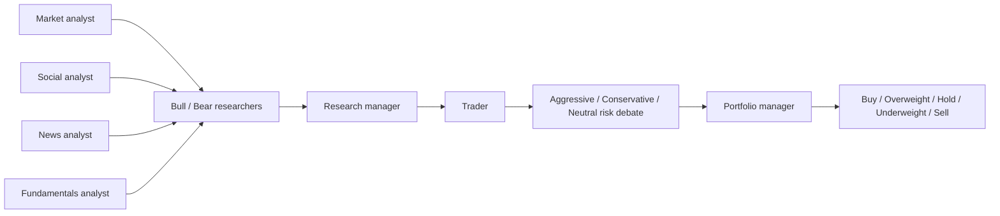

# TradingAgents 邏輯與程式架構評估

評估基準：`TauricResearch/TradingAgents` main commit `a33fd4c0f134485a43553a2c23a63cb14adbd88f`（2026-08-21 重新核對仍為 upstream `main`；本企劃固定版本）。

## 1. 它實際怎麼運作

TradingAgents 以 LangGraph 建立單一股票的多角色研究流程：

主要 state 包含各 analyst report、investment debate state、trader investment plan、risk debate state 和 final trade decision。Portfolio Manager 綜合 trader plan 與三種風險觀點，輸出五級動作；signal processor 再抽取結論。

## 2. 值得採用的概念

- **角色分工**：市場、新聞、社群、基本面不是一個 prompt 全包。
- **先獨立研究後辯論**：能顯式保存 bull/bear 和 risk dissent。
- **有限輪次**：避免無限 agent 對談。
- **共享 state graph**：每一步輸出可成為 audit trail。
- **模型分層**：quick/deep 模型概念適合控制大量分析成本。
- **memory/evaluation idea**：可將過去決策結果回饋研究，但必須重新實作以避免資料洩漏。

## 3. 不適合直接用於自動交易的地方

### 3.1 問題定義是單一 ticker，不是跨股票組合

它回答「這一檔如何」，沒有建立 point-in-time universe、候選排名、資金競爭、相關性、sector exposure 或 portfolio optimization。本專案需先做 universe/quant/evidence funnel，再對少量候選執行辯論。

### 3.2 Portfolio Manager 是語言模型，只能作提案層

上游 Portfolio Manager 看的是文字 plan 和風險辯論，預設不掌握權威 broker cash、lots、open orders、ADV、當日 turnover 或完整持倉。因此本專案會保留這個角色，但重寫輸入／輸出：每次強制提供去識別化完整 portfolio snapshot，只允許輸出結構化 target-weight `PortfolioProposal`，再交給獨立 deterministic Risk Engine 審核。

### 3.3 沒有券商級狀態機

上游沒有：

- transactional outbox；
- deterministic `client_order_id`；
- timeout 後查單再重試；
- partial fill / cancel / reject / out-of-order update；
- 啟動與重連 reconciliation；
- broker position/cash authority；
- missed-window 和 market calendar lease。

### 3.4 結構化失敗不應回落自由文字

研究程式可容忍解析 fallback，但交易程式不能把 schema 失敗的自由文字猜成 action。本專案中 parsing、model、timeout、429 或 citation verification 失敗全部為 `INVALID/NO_TRADE`。

### 3.5 角色可能高度相關

多個角色共享相同模型、相同資料和相似 prompt，形式上多人不代表獨立資訊。若所有人重述同一篇新聞，投票會產生虛假信心。本專案採 blinded first pass、source-overlap correlation haircut 和 domain relevance。

### 3.6 資料與記憶不是 point-in-time ledger

動態抓取的新聞／基本面會變；Markdown memory、per-ticker local data 或模型反思不能證明歷史 run 當時能看到哪些內容。回測需要 immutable source manifest、available_at 和版本化快照。

### 3.7 缺乏營運控制

研究 repo 不需要具備雙程序 lease、health checks、kill switch、告警、RTO/RPO 和 fault injection，但無人值守交易需要。

## 4. 本專案如何使用它

P3 主線直接採用其 **分析方法與 graph 語意**，但不直接 fork 成交易核心；實作採「semantic parity + 本專案 versioned contracts + 隔離 adapter」：

| TradingAgents 概念 | 本專案版本 |
|---|---|
| Market/Technical Analyst | point-in-time bars/indicators/regime 的 `AnalystReport` |
| Fundamentals Analyst | filing/financial/valuation inputs 的 `AnalystReport` |
| News Analyst | company/industry/global/macro event `AnalystReport` |
| Sentiment Analyst | 合規、可回溯、時間戳完整的 sentiment `AnalystReport` |
| Bull/Bear debate | 有限輪次、保存雙方 history、claim/citation/conflict verification |
| Research Manager | 結構化 `ResearchConclusion`；不可憑空新增 evidence |
| Trader | 結構化 trader plan；沒有 order authority |
| Risk debate | 兩輪 Aggressive/Conservative/Neutral 認知風險辯論；不可放寬 hard limits |
| Portfolio Manager | 看完整去識別化持倉／帳戶／剩餘限制，輸出結構化 `PortfolioProposal` |
| Final signal | `PortfolioProposal` → deterministic `RiskDecision` → approved `TargetPortfolio`；第一次拒絕只允許重申一次 |
| Memory | 每日 outcome/reflection + 每週 bounded compaction；immutable raw audit 防 future leakage |

不要求 production P3 與上游逐位元輸出一致；要求 graph 順序、角色責任、最大輪次與資料流可由 semantic-parity tests 證明。上游 structured-output 仍有 free-text fallback，本專案禁止 fallback 結果穿越 P3→P4 boundary。

直接移植需要的 TradingAgents code 時，只能包在 `AnalysisProvider` sandbox，並保留固定 SHA 的 Apache-2.0 license／attribution／NOTICE（若有）、標示本專案修改；不 fork，也不複製 CLI、simulated exchange 或 order path：

- 無 Alpaca credentials；
- 無 order/ledger DB write；
- 無 shell 或任意工具；
- 只讀 sanitized EvidencePacket；
- 嚴格 schema、timeout、token、network allowlist；
- 固定 upstream SHA、dependency lock、graph/prompt/provider versions；
- 失敗輸出 `INVALID/ABSTAIN`，不得把自由文字猜成 action。

## 5. 採用 Portfolio Manager 但保留 deterministic Risk authority

「風險辯論」是認知風險檢查，「Risk Engine」是資金安全機制，兩者不可互換。Portfolio Manager可綜合研究、持倉、cash、buying power、open orders、same-day fills 與 limits，提出 long/short target weights；但 Risk Engine 必須機械地拒絕第 16 檔、超過 15% 單股、gross/net/turnover/borrow breach、無正當理由的同日虧損退出、stale quote 或帳務不一致。

Risk 第一次拒絕時回傳 machine-readable reason codes 與 remaining limits；Portfolio Manager可以重申一次。不得重跑無限迴圈，第二次拒絕固定 `NO_TRADE`。任何核准後 quantity/order type 仍由 deterministic P4/P2 產生。

### 5.1 本專案新增的必要改造

- Bull/Bear 與 Risk Debate 各固定兩輪。
- Analysts 預設 Agnes 2.5 Flash、備援 Agnes 2.0 Flash；其他深度角色預設 Muse Spark 1.2 Contributor、備援 Agnes 2.5 Flash。
- 每個 adapter 要求最高可用 reasoning，記錄 requested/effective capability，只備援一次。
- Portfolio Manager confidence < 0.65 強制 `HOLD`；輸出只有 `OPEN/INCREASE/REDUCE/CLOSE/HOLD`、signed target weight、evidence ids 與短 reason codes。
- 同日虧損退出需明確的 thesis/event/borrow/liquidity/hard-risk 證據；短線獲利退出不受此特殊理由限制。
- 每日寫 reflection；週六用專用 skill 壓縮 LLM-visible memory 至最多 4,000 行，原始 audit 永久保留。
- 突發事件在進 LLM 前由 deterministic verifier 做來源、freshness 與 conflict 二次確認；緊急 graph 只能處理受影響持倉且不可新增風險。

## 6. Upstream 追蹤策略

- 固定 commit SHA，不依 main 浮動。
- 每季檢查 schema、graph、data vendors 和 license 變更。
- 只移植經測試且在 manifest 列明的 research/risk-debate/Portfolio Manager/memory 改善，不拉入 execution side effects。
- 上游更新需經 regression、prompt/eval drift 和 security review。
- 本專案的 ledger/risk/execution 永遠不依賴其版本。

## 7. 結論

TradingAgents 是 P3 的完整研究／提案方法基準：「四分析員—Bull/Bear—Research Manager—Trader—Risk Debate—Portfolio Manager」。本專案直接移植所需程式並改造成 point-in-time、完整 portfolio-aware、strict-schema、可重播的 proposal pipeline；它仍不是 brokerage operating system。deterministic Risk approval、target-to-order translation 與 P2 execution 永遠保留在本專案。七人蒸餾降為停用的 Future Analyst Plugin，不阻塞 P3。

## 8. 固定程式參考

- [Graph setup](https://github.com/TauricResearch/TradingAgents/blob/a33fd4c0f134485a43553a2c23a63cb14adbd88f/tradingagents/graph/setup.py)
- [Agent states](https://github.com/TauricResearch/TradingAgents/blob/a33fd4c0f134485a43553a2c23a63cb14adbd88f/tradingagents/agents/utils/agent_states.py)
- [Schemas](https://github.com/TauricResearch/TradingAgents/blob/a33fd4c0f134485a43553a2c23a63cb14adbd88f/tradingagents/agents/schemas.py)
- [Portfolio manager](https://github.com/TauricResearch/TradingAgents/blob/a33fd4c0f134485a43553a2c23a63cb14adbd88f/tradingagents/agents/managers/portfolio_manager.py)
- [Signal processing](https://github.com/TauricResearch/TradingAgents/blob/a33fd4c0f134485a43553a2c23a63cb14adbd88f/tradingagents/graph/signal_processing.py)
- [Default config](https://github.com/TauricResearch/TradingAgents/blob/a33fd4c0f134485a43553a2c23a63cb14adbd88f/tradingagents/default_config.py)
